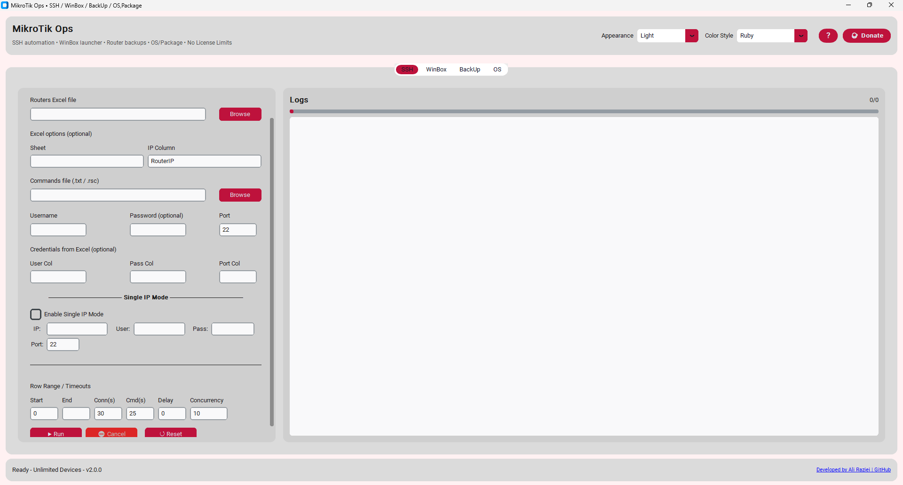
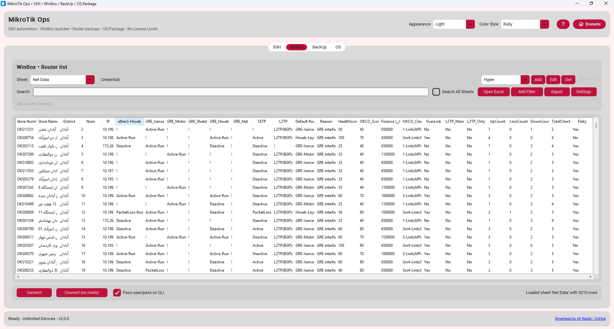
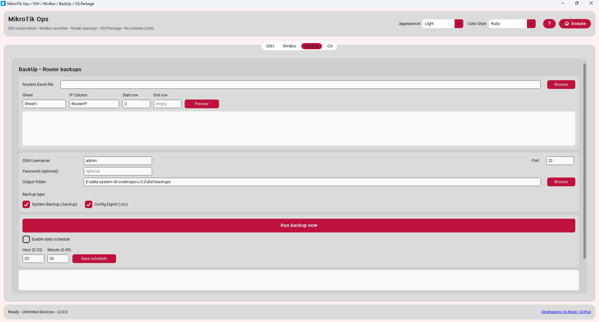
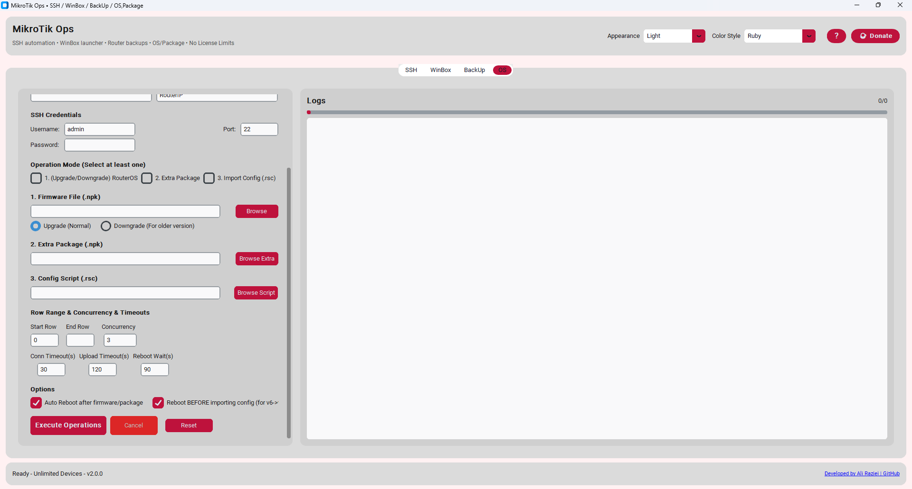

[Tool] MikroTik Ops v2.0 - Free Desktop Manager for Multiple Routers

Hi everyone, 

I want to share a free tool I've been developing for managing multiple MikroTik routers simultaneously.

## 🔧 What is MikroTik Ops?

A Windows desktop application that combines the most needed daily tasks into one clean interface.

## 🆕 What's New in v2.0

✅ **Complete Help System** - Click "?" button for full user guide
✅ **Global Search** - Search across ALL sheets in Excel file
✅ **Multi-Value Filters** - Select multiple values from a list
✅ **Credential Profiles** - Shared between SSH, WinBox, and Backup tabs
✅ **Keyboard Shortcuts** - Ctrl+C, Ctrl+V, Ctrl+A, Shift+Arrows, Enter, Shift+Enter
✅ **Right-Click Menu** - Copy, Paste, Cut, Delete in search box
✅ **Donation Page** - Support development with crypto (BTC, ETH, TRC20, USDT)
✅ **Smart Firmware Update** - Optimized ordering for v6→v7 upgrades
✅ **Summary CSV** - Detailed status for each router in IOS tab

## ⚡ Features

✅ **SSH Automation** - Run commands on unlimited routers at once
✅ **WinBox Launcher** - Browse routers from Excel, save credential profiles  
✅ **Backup Manager** - Automated .backup and .rsc exports with scheduling
✅ **Firmware Updater** - Upload .npk files, install packages, import config scripts

## 💯 Why it's different

- No license - Use on unlimited devices
- No internet required - Works offline
- Portable - Single .exe file
- Free forever (donation supported)

## 📥 Download

**GitHub:** https://github.com/Ali-Raziei/MikroTikOps

**Direct Download:** https://github.com/Ali-Raziei/MikroTikOps/releases/latest

## 📸 Screenshots

| SSH Tab | WinBox Tab |
|---------|------------|
|  |  |

| Backup Tab | IOS Tab |
|------------|---------|
|  |  |

## ❓ Requirements

- Windows 10/11 (Windows 7 with Python)
- No admin rights needed

☕ Donation
If this tool saves you time and helps your business, please consider supporting its development.
Crypto Donations
Currency	Address
Bitcoin (BTC)	  :   bc1q7n8ah87kzmgaa94squjswk03nc8at79y0um5e2
Ethereum (ETH)	:   0xd1b9df54e2db7123857e9eed9a3486a4e93c66d8
USDT BEP20(BSC) :   0x863c2dffa2f01abc563dc54f186c3d05546e2b21
## 🤝 Feedback

I'd love to hear your thoughts, feature requests, or bug reports!

---

#MikroTik #NetAdmin #FreeTool #RouterOS
